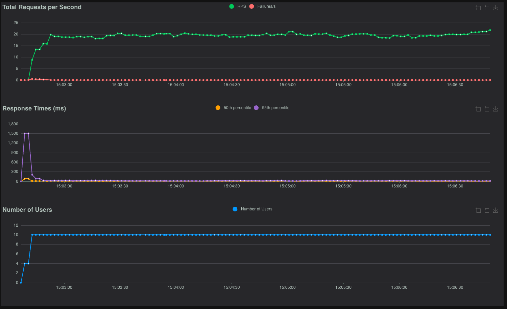
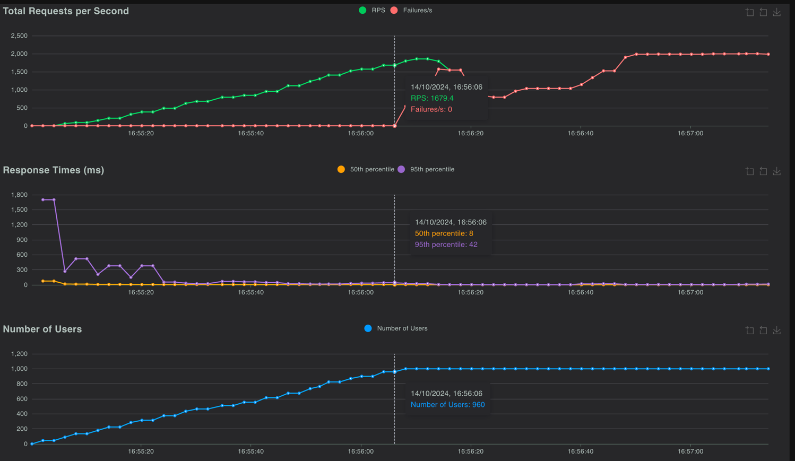
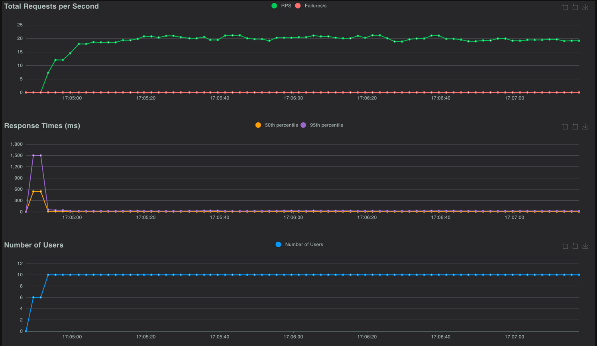
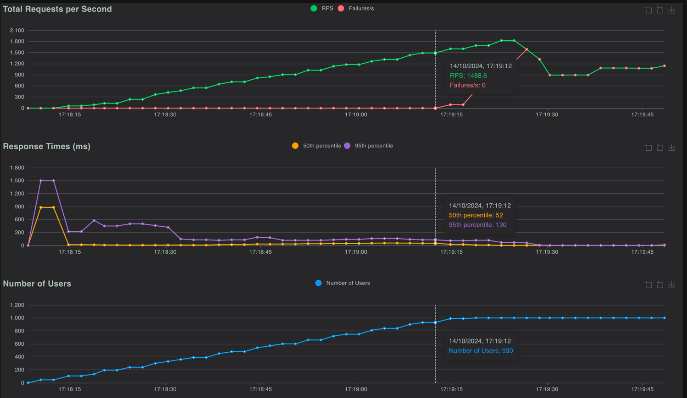

# Auth SPA for secrets

Try to allow download "secrets" like x-api-keys for SPA only for auth users.

## DISCLAIMER : NOT USE THIS TO STORE CRITICAL SECRETS LIKE PASSWORDS, KEYS, ETC.
XApiKeys in SPA are used only to identify the application that is using the backend. 
BackEnd or APIGateway should validate the key and jwt, allowing or deny the request.


## What is this test consists of?

The Proof of Concept (POC) consists of setting up a test environment using NGINX and Node.js as web servers to serve a 
Single Page Application (SPA). 
The POC aims to validate the configuration and functionality for securely serving the SPA and providing access to certain
sensitive information ("secrets") that the SPA requires for its operation, such as an x-api-key.

The POC involve NGINX with the ngx_http_js_module.so module and a Node.js service to validate fetching 
user information using JWT authentication and serving "secrets" securely.

### NGINX Configuration with ngx_http_js_module.so
NGINX will use the ngx_http_js_module.so module to execute JavaScript for handling requests.
When a request is made to fetch "secrets," the module will verify the JWT (JSON Web Token) to authenticate the user calling user profile API.
If the JWT validation is successful, NGINX will retrieve and return the requested secrets to the SPA.
If the authentication fails, NGINX will respond with an appropriate error (e.g., 401 Unauthorized).

### Native Node.js Backend
The Node.js service will handle similar functionality natively by verifying JWTs in incoming requests.
It will provide an API route that serves the "secrets" when authentication is successful.
This route will allow for a direct comparison of handling JWT verification and secrets retrieval in both NGINX and Node.js environments.


For this POC, testing the performance under high load while using a reduced amount of CPU and RAM will be a key focus. 
The goal is to evaluate how well NGINX with the ngx_http_js_module.so and Node.js perform under constrained system 
resources when serving the SPA and handling JWT authentication to fetch "secrets."


Using [Locust](https://locust.io/) for the stress testing in this POC will allow for effective simulation of high load conditions 
to evaluate the performance of NGINX and Node.js under limited CPU and RAM.


## Result:

### Functional test

Setup environment:
```shell
docker-compose up
```

Run js test:
```shell
node test/test.js
```

If

    *********************************************
    ****************** DONE! ********************
    *********************************************

is printed, the test is successful.

Shutdown environment:
```shell
docker-compose down
```

# Performance test

Where the test is executed:
* GCP hosting
* Machine type: e2-medium - 2vCPU - 4GB Ram
* Architecture: x86/64

Server to be exposed for testing in order to restit to high load is running `python3 -m http.server 9000`


We create 4 environments:
* NJS-open (NGINX with ngx_http_js_module.so) with hegh resource limits
* Node-open (Node.js) without resource limits
* NJS-slim (NGINX with ngx_http_js_module.so) with 0,25 CPU and 50MB RAM
* Node-slim (Node.js) with 0,25 CPU and 50MB RAM

We test with this locust configuration:
* Low load
  * Number of users: 10
  * Ramp-up: 2 users starting every seconds 
* High load
  * Number of users: 1000
  * Ramp-up: 15 users starting every seconds

!! Docker resetted every test to avoid caching and other side effects. !!


Setup environment:
```shell
docker-compose -f docker-compose-stress.yaml up
```

[Install locust](https://docs.locust.io/en/stable/installation.html) if not installed.


Run locust:
```shell
locust -f stresstest/locustfile.py
```

## Highlights NJS-open

### Low load
| Type | Name             | # Requests | # Fails | Median (ms) | 95%ile (ms) | 99%ile (ms) | Average (ms) | Min (ms) | Max (ms) | Average size (bytes) | Current RPS | Current Failures/s |
|------|------------------|------------|---------|-------------|-------------|-------------|--------------|----------|----------|----------------------|-------------|---------------------|
| GET  | /hello           | 1608       | 0       | 3           | 7           | 9           | 3.73         | 1        | 34       | 0                    | 7.6         | 0                   |
| GET  | /secret          | 3272       | 0       | 9           | 23          | 46          | 13.11        | 3        | 1494     | 32                   | 14.1        | 0                   |
| Aggregated |            | 4904       | 2       | 7           | 21          | 36          | 10.14        | 1        | 1494     | 25.18                | 21.7        | 0                   |



### High load
| Type       | Name             | # Requests | # Fails | Median (ms) | 95%ile (ms) | 99%ile (ms) | Average (ms) | Min (ms) | Max (ms) | Average size (bytes) | Current RPS | Current Failures/s |
|------------|------------------|------------|---------|-------------|-------------|-------------|--------------|----------|----------|----------------------|-------------|---------------------|
| GET        | /hello           | 57113      | 37551   | 2           | 13          | 39          | 83.09        | 1        | 25941    | 0                    | 658         | 658                 |
| GET        | /secret          | 115236     | 75728   | 2           | 28          | 190         | 90.24        | 1        | 25942    | 10.97                | 1328        | 1328                |
| Aggregated |                  | 172379     | 113279  | 2           | 22          | 130         | 87.88        | 1        | 25942    | 7.5                  | 1986        | 1986                |



## Highlights NJS-slim

### Low load
| Type       | Name    | # Requests | # Fails | Median (ms) | 95%ile (ms) | 99%ile (ms) | Average (ms) | Min (ms) | Max (ms) | Average size (bytes) | Current RPS | Current Failures/s |
|------------|---------|------------|---------|-------------|-------------|-------------|--------------|----------|----------|----------------------|-------------|---------------------|
| GET        | /hello  | 974        | 0       | 4           | 7           | 8           | 3.84         | 1        | 18       | 0                    | 7.4         | 0                   |
| GET        | /secret | 1937       | 0       | 11          | 26          | 51          | 15.3         | 4        | 1541     | 32                   | 11.7        | 0                   |
| Aggregated |         | 2911       | 0       | 8           | 22          | 37          | 11.46        | 1        | 1541     | 21.29                | 19.1        | 0                   |


### High load
| Type       | Name             | # Requests | # Fails | Median (ms) | 95%ile (ms) | 99%ile (ms) | Average (ms) | Min (ms) | Max (ms) | Average size (bytes) | Current RPS | Current Failures/s |
|------------|------------------|------------|---------|-------------|-------------|-------------|--------------|----------|----------|----------------------|-------------|---------------------|
| GET        | /hello           | 33752      | 15541   | 5           | 77          | 160         | 153.58       | 1        | 25943    | 0                    | 384.4       | 384.4               |
| GET        | /secret          | 67691      | 30816   | 11          | 150         | 580         | 170.5        | 1        | 25945    | 17.43                | 757.9       | 757.9               |
| Aggregated |                  | 101473     | 46357   | 8           | 130         | 470         | 164.88       | 1        | 25945    | 11.9                 | 1142.3      | 1142.3              |

