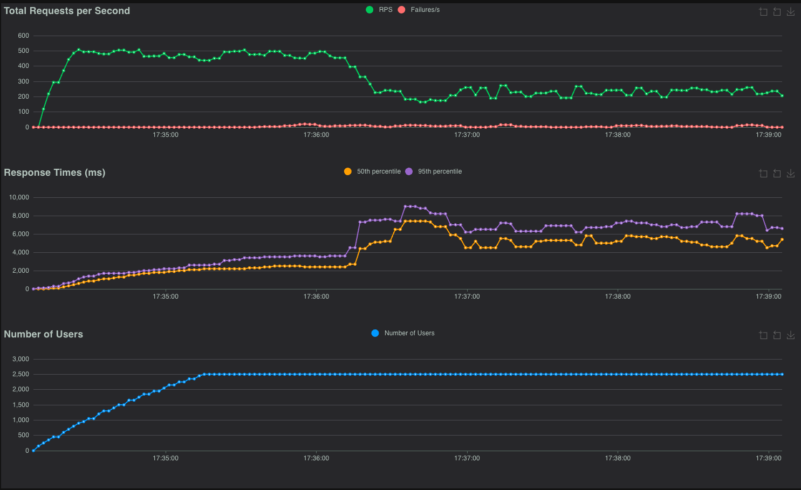
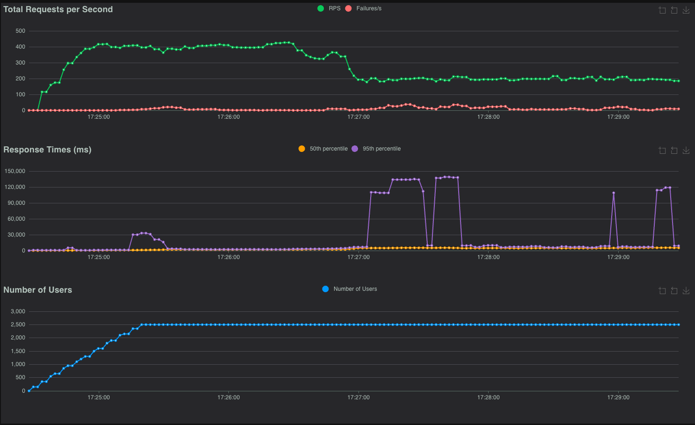

# Auth SPA for secrets

This Proof of Concept (POC) involves setting up a test environment using NGINX and Node.js as web servers to serve a Single Page Application (SPA). 
The POC aims to validate the configuration and functionality for securely serving the SPA and providing access to certain sensitive information ("secrets") 
that the SPA requires for its operation, such as an x-api-key. 
The POC involves using NGINX with the `ngx_http_js_module.so` module and a Node.js service to validate fetching 
user information using JWT authentication and serving "secrets" securely.


## DISCLAIMER : NOT USE THIS TO STORE CRITICAL SECRETS LIKE PASSWORDS, KEYS, ETC.
XApiKeys in SPA are used only to identify the application that is using the backend. 
BackEnd or APIGateway should validate the key and jwt, allowing or deny the request.


## What is this test consists of?
The Proof of Concept (POC) consists of setting up a test environment using NGINX and Node.js as web servers to serve a 
Single Page Application (SPA). 
The POC aims to validate the configuration and functionality for securely serving the SPA and providing access to certain
sensitive information ("secrets") that the SPA requires for its operation, such as an x-api-key.

The POC involve NGINX with the ngx_http_js_module.so module and a Node.js service to validate fetching 
user information using JWT authentication and serving "secrets" securely.

### NGINX Configuration with ngx_http_js_module.so
NGINX will use the ngx_http_js_module.so module to execute JavaScript for handling requests.
When a request is made to fetch "secrets," the module will verify the JWT (JSON Web Token) to authenticate the user calling user profile API.
If the JWT validation is successful, NGINX will retrieve and return the requested secrets to the SPA.
If the authentication fails, NGINX will respond with an appropriate error (e.g., 401 Unauthorized).

### Native Node.js Backend
The Node.js service will handle similar functionality natively by verifying JWTs in incoming requests.
It will provide an API route that serves the "secrets" when authentication is successful.
This route will allow for a direct comparison of handling JWT verification and secrets retrieval in both NGINX and Node.js environments.


For this POC, testing the performance under high load while using a reduced amount of CPU and RAM will be a key focus. 
The goal is to evaluate how well NGINX with the ngx_http_js_module.so and Node.js perform under constrained system 
resources when serving the SPA and handling JWT authentication to fetch "secrets."


Using [Locust](https://locust.io/) for the stress testing in this POC will allow for effective simulation of high load conditions 
to evaluate the performance of NGINX and Node.js under limited CPU and RAM.


## Result:

### Functional test

Setup environment:
```shell
docker-compose up
```

Run js test:
```shell
node test/test.js
```

If

    *********************************************
    ****************** DONE! ********************
    *********************************************

is printed, the test is successful.

Shutdown environment:
```shell
docker-compose down
```

# Performance test

Where the test is executed:
* GCP hosting
* Machine type: e2-medium - 2vCPU - 4GB Ram
* Architecture: x86/64


We create 2 environments:
* NJS (NGINX with ngx_http_js_module.so) with resource limits
* Node (Node.js) with resource limits

Docker used to running all systems:
* fake-oauth: Fake OAuth2 server to generate valid JWT
* nginx: stock NGINX image only to serve 200 status on high load

We test with this locust configuration for 5 minutes:
  * Number of users: 2500
  * Ramp-up: 50 users starting every seconds

!! Docker resetted every test to avoid caching and other side effects. !!


Setup environment:
```shell
docker-compose -f docker-compose-stress.yaml up
```

[Install locust](https://docs.locust.io/en/stable/installation.html) if not installed.


Run locust:
```shell
locust -f stresstest/locustfile.py
```

## NGINX

| Type       | Name    | # Requests | # Fails | Median (ms) | 95%ile (ms) | 99%ile (ms) | Average (ms) | Min (ms) | Max (ms) | Average size (bytes) | Current RPS | Current Failures/s |
|------------|---------|------------|---------|-------------|-------------|-------------|--------------|----------|----------|----------------------|-------------|---------------------|
| GET        | /hello  | 32610      | 487     | 2500        | 6700        | 21000       | 4280.24      | 2        | 223673   | 0                    | 69.9        | 0                   |
| GET        | /secret | 65188      | 932     | 2600        | 7000        | 31000       | 4462.54      | 2        | 223672   | 31.54                | 136.3       | 0                   |
| Aggregated |         | 97798      | 1419    | 2600        | 7000        | 27000       | 4401.75      | 2        | 223673   | 21.02                | 206.2       | 0                   |


[nginx_high.html](resources/nginx_high.html)

## Node.js

### High
| Type       | Name    | # Requests | # Fails | Median (ms) | 95%ile (ms) | 99%ile (ms) | Average (ms) | Min (ms) | Max (ms) | Average size (bytes) | Current RPS | Current Failures/s |
|------------|---------|------------|---------|-------------|-------------|-------------|--------------|----------|----------|----------------------|-------------|---------------------|
| GET        | /hello  | 28115      | 589     | 1200        | 3600        | 134000      | 4056.88      | 2        | 268630   | 0                    | 65.8        | 1.5                 |
| GET        | /secret | 55507      | 2169    | 2300        | 7700        | 134000      | 5707.69      | 4        | 266927   | 31                   | 119.4       | 7.7                 |
| Aggregated |         | 83622      | 2758    | 2100        | 6800        | 134000      | 5152.66      | 2        | 268630   | 20.58                | 185.2       | 9.2                 |


[node_heigh.html](resources/node_heigh.html)

## Result 

1. **Requests and Failures**
   - **NGINX**: Processed a total of 97,798 requests, with 1,419 failures (failure rate of approximately 1.45%).
   - **Node.js**: Handled 83,622 requests, with 2,758 failures (failure rate of around 3.3%).
   - **Observation**: NGINX had a higher request count and a lower failure rate, indicating better reliability under the given load.

2. **Response Time Metrics**
   - **Median Response Time**:
     - NGINX: 2,500 ms for `/hello`, 2,600 ms for `/secret`.
     - Node.js: 1,200 ms for `/hello`, 2,300 ms for `/secret`.
     - **Observation**: Node.js had a lower median response time, especially for the `/hello` endpoint, indicating that it could handle requests faster at the median level.
   - **95th Percentile Response Time**:
     - NGINX: 6,700 ms for `/hello`, 7,000 ms for `/secret`.
     - Node.js: 3,600 ms for `/hello`, 7,700 ms for `/secret`.
     - **Observation**: Node.js had better response times at the 95th percentile for the `/hello` endpoint but was worse than NGINX for `/secret`.
   - **99th Percentile Response Time**:
     - NGINX: 21,000 ms for `/hello`, 31,000 ms for `/secret`.
     - Node.js: 134,000 ms for both `/hello` and `/secret`.
     - **Observation**: NGINX showed significantly better performance in handling outlier cases, with much lower response times at the 99th percentile compared to Node.js.

3. **Average Response Time**
   - NGINX: 4,280 ms for `/hello`, 4,462 ms for `/secret`, with an overall average of 4,401 ms.
   - Node.js: 4,056 ms for `/hello`, 5,707 ms for `/secret`, with an overall average of 5,153 ms.
   - **Observation**: NGINX had a slightly higher average response time for `/hello` but was better overall due to its more consistent performance across endpoints.

4. **Current Requests Per Second (RPS)**
   - NGINX: 206.2 RPS in aggregate.
   - Node.js: 185.2 RPS in aggregate.
   - **Observation**: NGINX handled a higher number of requests per second, indicating better throughput under the given conditions.

5. **Failure Rate**
   - NGINX: Showed no significant current failures per second.
   - Node.js: Recorded failures at a rate of 1.5 failures/s for `/hello` and 7.7 failures/s for `/secret`.
   - **Observation**: Node.js had a higher rate of request failures, which could indicate instability under the given load.

**Conclusion**
- **NGINX** outperforms Node.js in terms of request throughput (RPS), consistency in response times (especially at the 99th percentile), and a lower failure rate. It appears to be more reliable under higher loads.
- **Node.js** offers better median response times, indicating quicker handling of the average request, but struggles more with high latency outliers and higher failure rates under stress.
- NGINX seems more suitable for handling a high number of concurrent requests, while Node.js might perform well for scenarios where lower latency for the median request is more critical.
